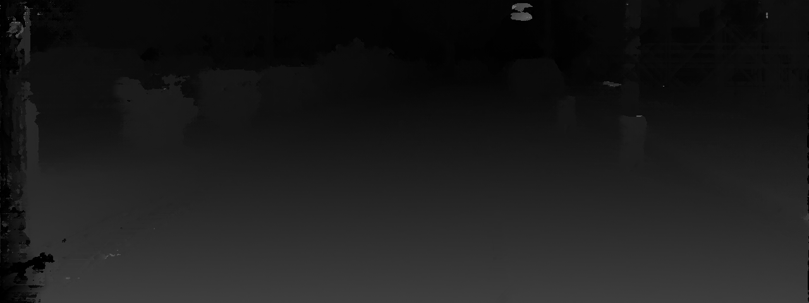
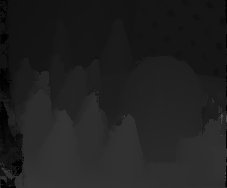

# SGM Stereo Matching Cuda

## build sgm
```bash
mkdir build
cd build
cmake ..
make -j4
```

## how to Run
```
./sgm <p1> <p2> <left_img_dir> <right_img_dir>

e.g: ./sgm 8 71 ../img/2l.png ../img/2r.png
```

# Result
kitti


Opencv
